**完整代码收费 +   316595344     或    lz316595344  咨询**

**接毕业设计和论文**

**如果图片加载不出来可以去博客看 https://blog.csdn.net/qq_56450993/article/details/133552233**

**毕业设计所有选题地址**

**[github]👉https://github.com/XinChennn/allProjects**

**[gitee]👉https://gitee.com/xinchennn/allProjects**

**[忻辰的个人博客]👉https://www.ixinjiu.cn/articles/156**

# 基于Springboot的网上商城(仿天猫)

## 一、系统介绍

需求设计主要参考天猫商城的购物流程：

用户从注册开始，到完成登录，浏览商品，加入购物车，进行下单，确认收货，评价等一系列操作。

作为迷你天猫商城的核心组成部分之一，管理后台包含商品管理，订单管理，类别管理，

用户管理和交易额统计等模块，实现了对整个商城的一站式管理和维护。

## 二、所用技术

后端技术栈：

- Spring Boot+MySQL+Druid+Log4j2+Maven+mybatis

前端技术栈：

- Echarts+Bootstrap

## 三、环境介绍

基础环境 :IDEA/eclipse, JDK 1.8, Mysql5.7及以上,Maven

源码+数据库脚本

所有项目以及源代码本人均调试运行无问题 可支持远程调试运行

所有页面均兼容IE10及以上现代浏览器。

## 四、项目界面

+ ##### 前台界面(部分)---

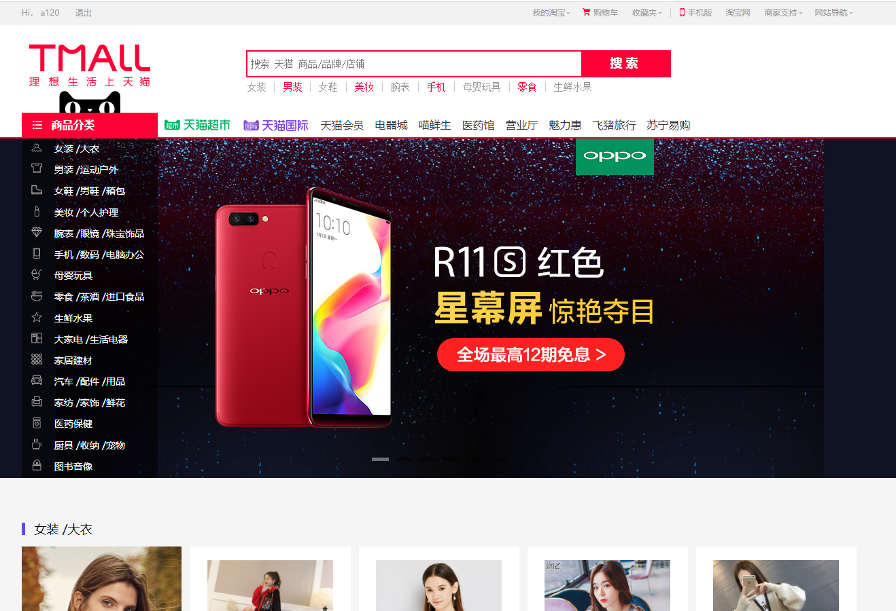

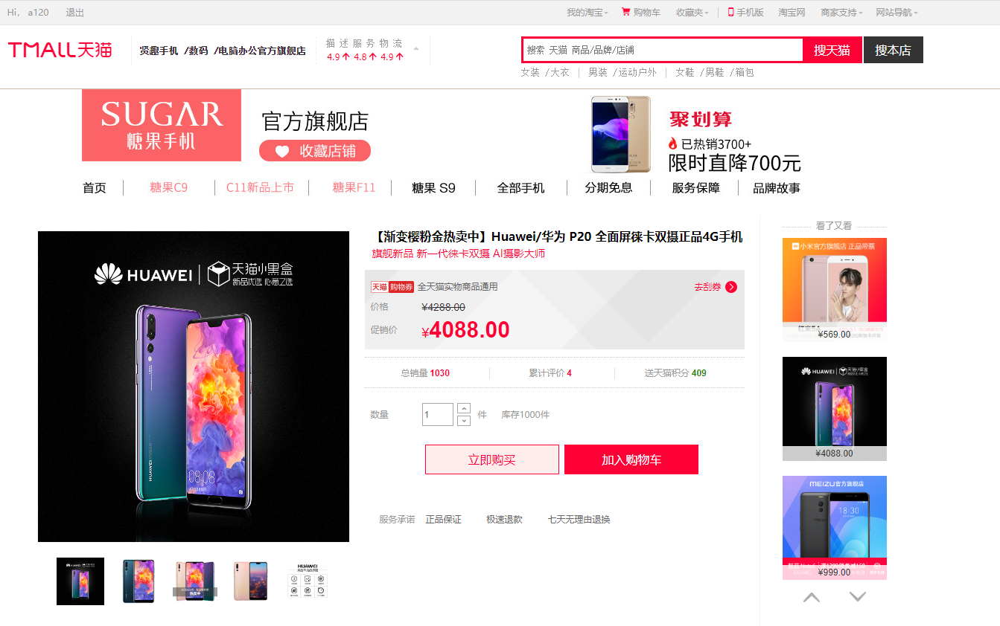

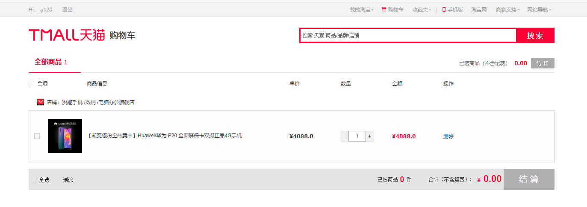

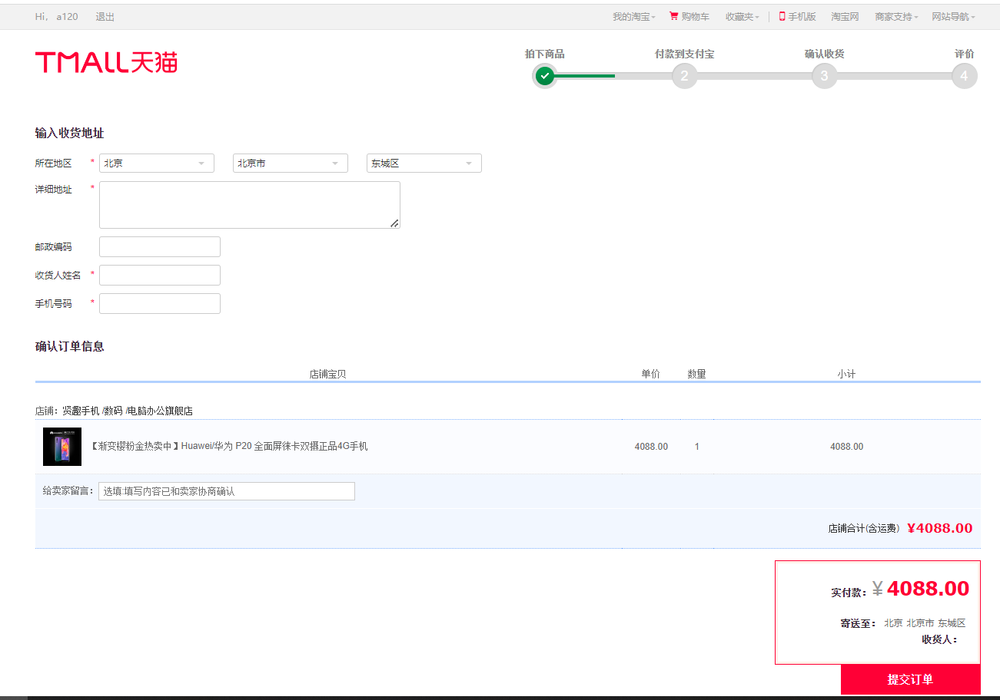

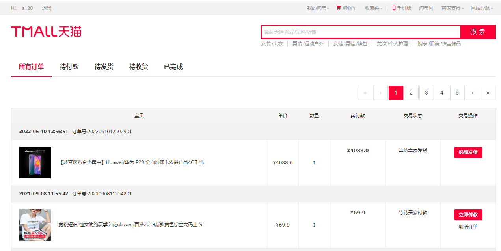

+ ##### 后台界面(部分)---

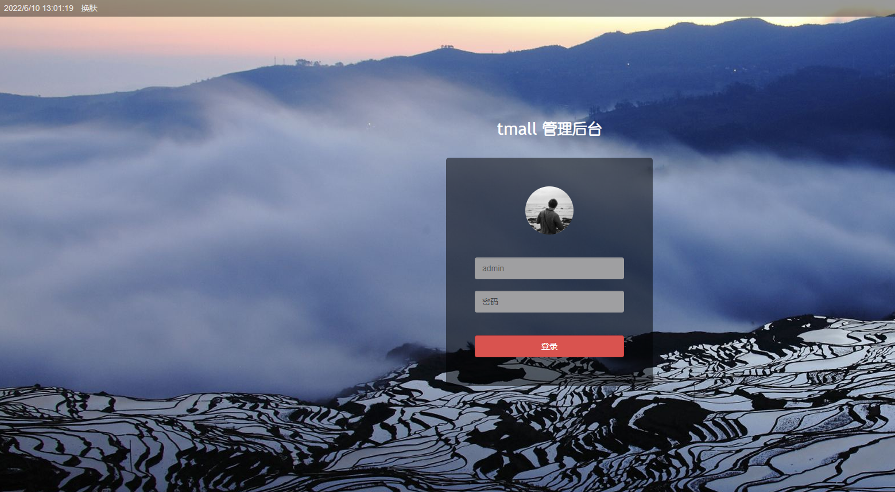

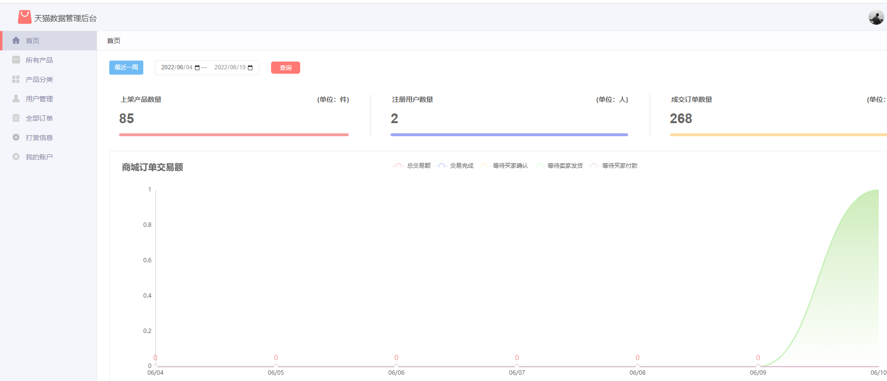

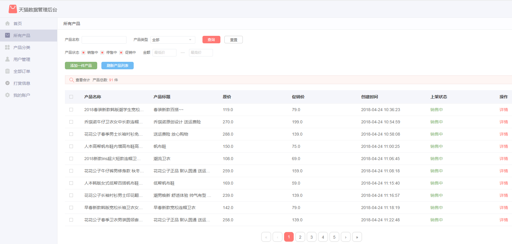

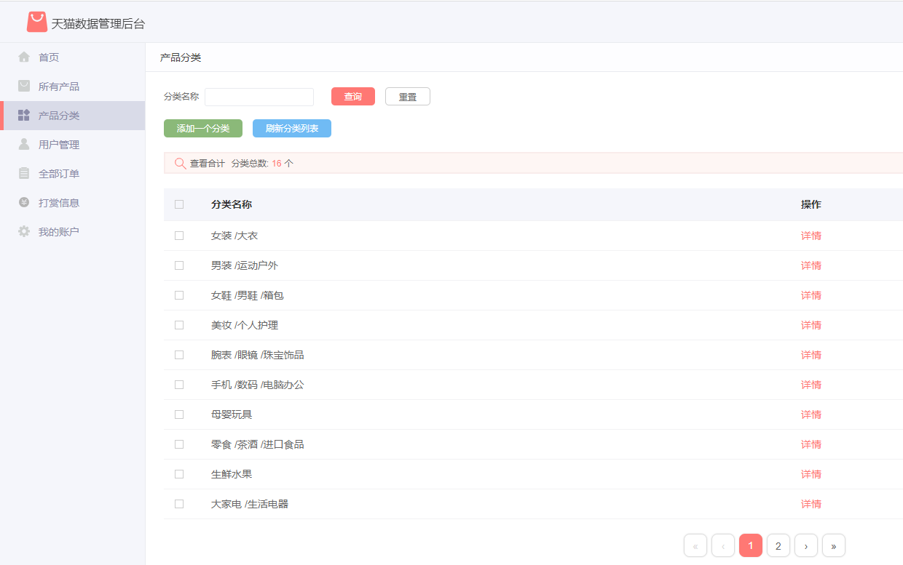

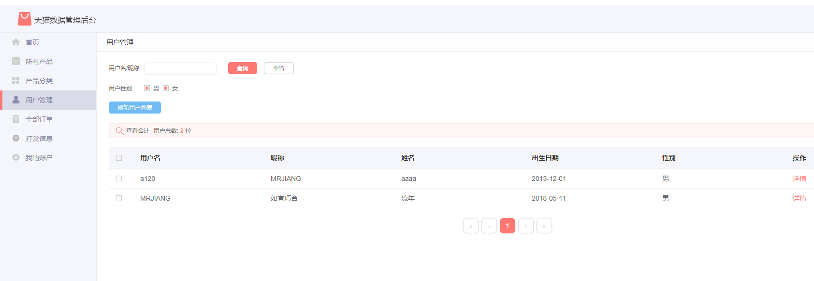

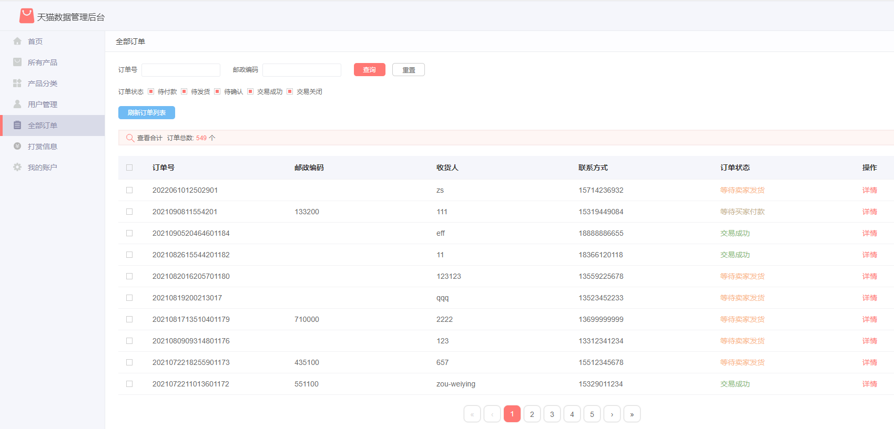

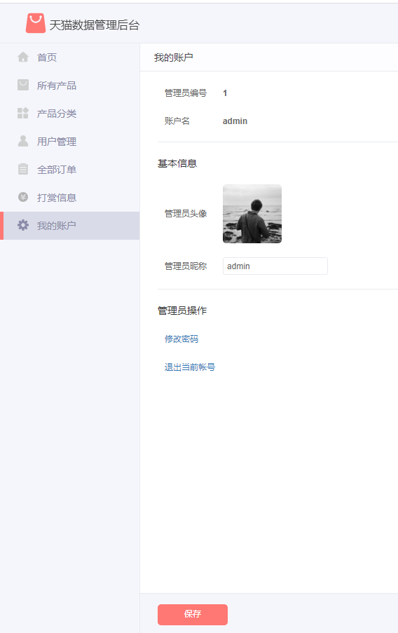

## 五、运行地址

+ 前台地址：<http://localhost:8080/tmall>  用户名：a120   密码： 123456
+ 后台地址：<http://localhost:8080/tmall/admin>  用户名：admin   密码： 123456

## 六、部署方式

1. 项目数据库为MySQL 8.0.32版本，在**db文件夹**中找到SQL文件并导入到数据库中（询问作者获取）。
2. 使用IDEA打开项目后，在maven面板刷新项目，下载依赖包。
3. 配置数据库连接并启动TmallSpringBootApplication即可。

## 注意事项：

1. 后台管理界面的订单图表没有数据为正常现象，该图表显示的为近7天的交易额。
2. 该项目同时兼容eclipse，但如有自行扩展代码的意愿，建议使用IDEA。

**完整代码 +   316595344     或    lz316595344  咨询** 

**接毕业设计和论文**